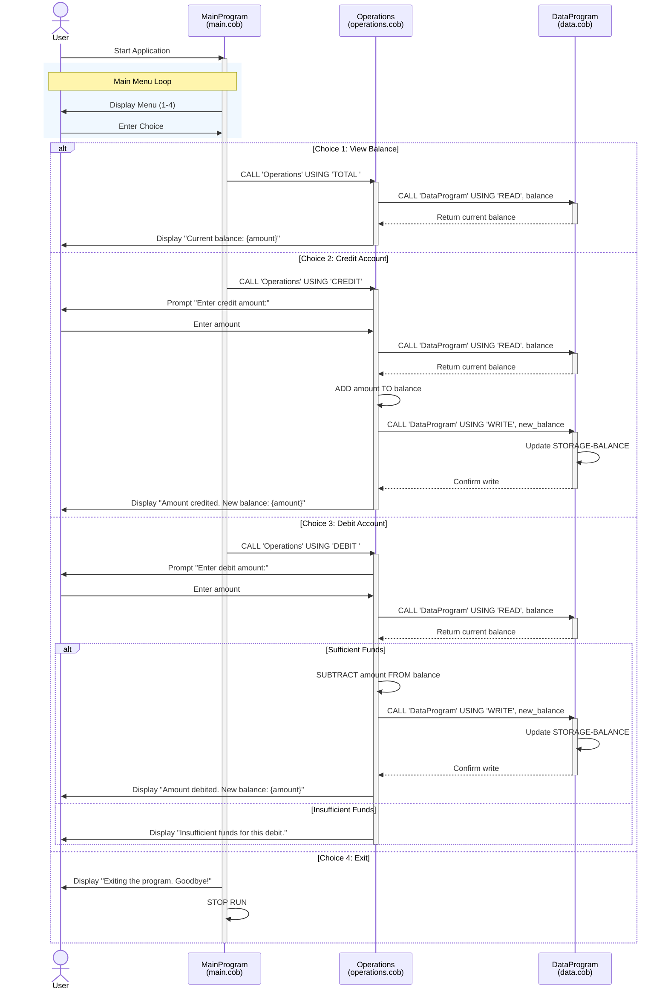
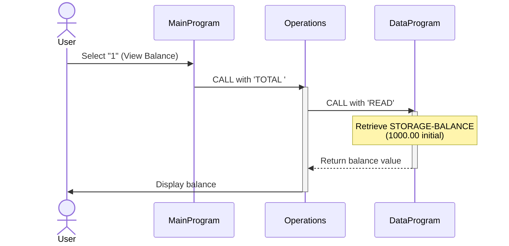
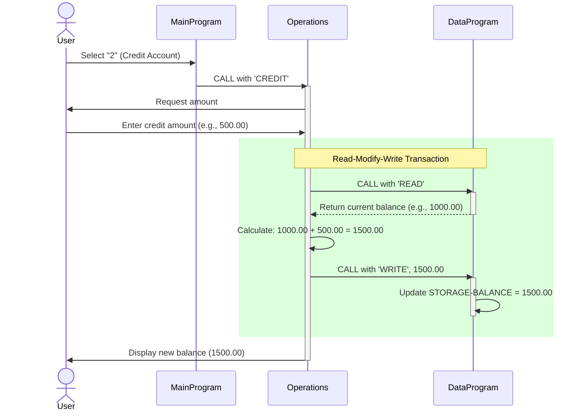
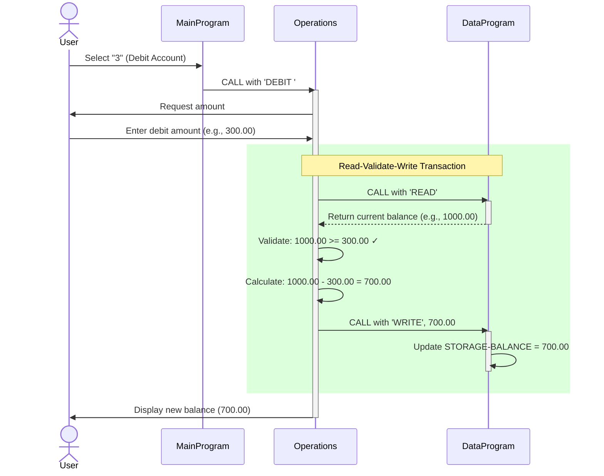
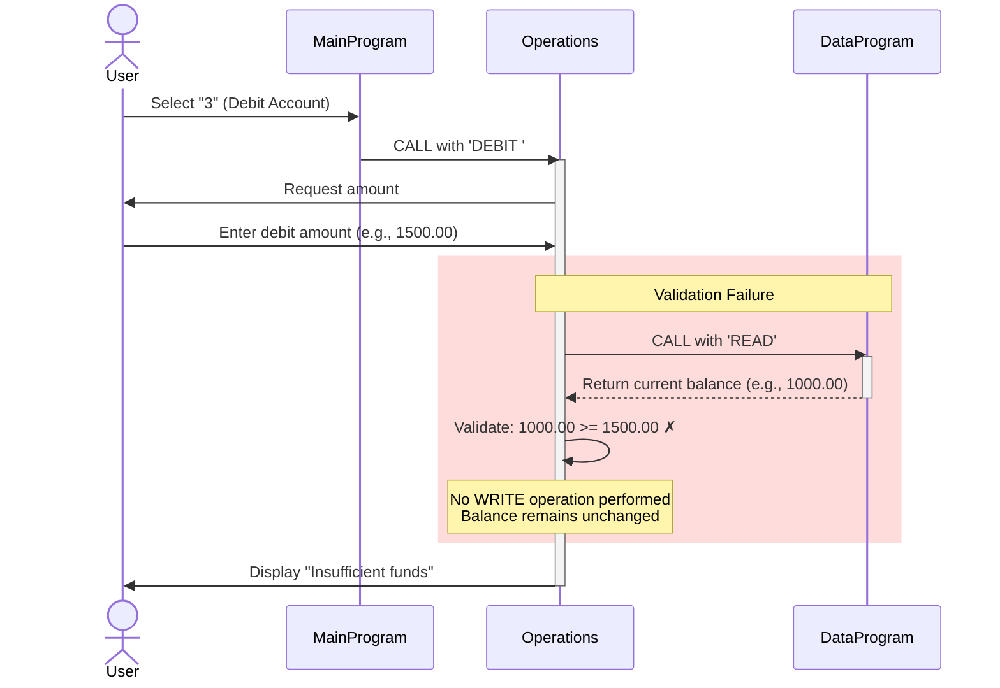

# COBOL Account Management System Documentation

## Overview

This COBOL application implements a simple Account Management System for student accounts. The system provides basic banking operations including viewing balance, crediting accounts, and debiting accounts with appropriate validation.

## System Architecture

The application follows a modular design with three separate COBOL programs:

```
main.cob → operations.cob → data.cob
```

- **main.cob**: User interface and main program flow
- **operations.cob**: Business logic for account operations
- **data.cob**: Data persistence layer for account balance

## File Descriptions

### 1. main.cob - Main Program Entry Point

**Program ID**: `MainProgram`

**Purpose**: 
- Serves as the primary entry point for the Account Management System
- Provides an interactive menu-driven user interface
- Routes user selections to appropriate operations

**Key Functions**:
- `MAIN-LOGIC`: Main processing loop that displays menu and processes user choices

**Menu Options**:
1. **View Balance** - Display current account balance
2. **Credit Account** - Add funds to the account
3. **Debit Account** - Withdraw funds from the account
4. **Exit** - Terminate the program

**Data Elements**:
- `USER-CHOICE`: Stores user menu selection (1-4)
- `CONTINUE-FLAG`: Controls main program loop (YES/NO)

**Program Flow**:
1. Displays menu options to the user
2. Accepts user input
3. Calls `Operations` program with appropriate operation code:
   - `'TOTAL '` for viewing balance
   - `'CREDIT'` for crediting account
   - `'DEBIT '` for debiting account
4. Repeats until user selects Exit option
5. Terminates gracefully with goodbye message

---

### 2. operations.cob - Business Logic Layer

**Program ID**: `Operations`

**Purpose**:
- Implements core business logic for account operations
- Handles user interactions for transaction inputs
- Validates transactions (e.g., insufficient funds checking)
- Coordinates with data layer for balance persistence

**Key Functions**:

#### VIEW BALANCE (`TOTAL`)
- Retrieves current balance from data layer
- Displays balance to user

#### CREDIT ACCOUNT (`CREDIT`)
- Prompts user for credit amount
- Retrieves current balance
- Adds credit amount to balance
- Saves updated balance
- Displays new balance to user

#### DEBIT ACCOUNT (`DEBIT`)
- Prompts user for debit amount
- Retrieves current balance
- **Validates sufficient funds** (key business rule)
- If funds are sufficient:
  - Subtracts debit amount from balance
  - Saves updated balance
  - Displays new balance
- If funds are insufficient:
  - Displays error message
  - Balance remains unchanged

**Data Elements**:
- `OPERATION-TYPE`: Operation to perform (TOTAL/CREDIT/DEBIT)
- `AMOUNT`: Transaction amount for credit/debit operations
- `FINAL-BALANCE`: Working variable for balance calculations

**Business Rules**:
1. **Insufficient Funds Protection**: Debit operations are rejected if requested amount exceeds current balance
2. **Balance Initialization**: Default starting balance is 1000.00
3. **Transaction Atomicity**: Balance updates only occur after successful validation

---

### 3. data.cob - Data Persistence Layer

**Program ID**: `DataProgram`

**Purpose**:
- Manages account balance storage
- Provides read/write interface for balance data
- Abstracts data storage from business logic

**Key Functions**:

#### READ Operation
- Returns current account balance to calling program

#### WRITE Operation
- Updates stored balance with new value

**Data Elements**:
- `STORAGE-BALANCE`: Persistent balance storage (initialized to 1000.00)
- `OPERATION-TYPE`: Type of data operation (READ/WRITE)
- `PASSED-OPERATION`: Operation type passed from caller
- `BALANCE`: Balance value exchanged with caller

**Design Pattern**:
Uses the **Data Access Object (DAO)** pattern to separate data management from business logic, enabling:
- Centralized balance storage
- Consistent data access interface
- Potential future migration to file or database storage

---

## Business Rules Summary

### Student Account Management Rules

1. **Initial Balance**: All accounts start with a balance of 1000.00

2. **Credit Transactions**:
   - No upper limit on credit amounts
   - Credits are added immediately to current balance
   - User enters amount at time of transaction

3. **Debit Transactions**:
   - Subject to insufficient funds checking
   - Cannot withdraw more than current balance
   - Failed debits display error message and preserve balance
   - User enters amount at time of transaction

4. **Balance Display**:
   - Shows current balance with 2 decimal precision
   - Format: 9(6)V99 (up to 999,999.99)

5. **Transaction Validation**:
   - All operations retrieve current balance before processing
   - Balance updates are atomic (read-validate-write sequence)

6. **User Interface**:
   - Menu-driven interaction
   - Input validation for menu choices (1-4)
   - Invalid choices prompt re-entry

---

## Data Format Specifications

### Balance Format
- **Type**: Numeric with decimal
- **Format**: `PIC 9(6)V99`
- **Range**: 0.00 to 999,999.99
- **Default**: 1000.00

### Operation Codes
- **Length**: 6 characters
- **Valid Codes**:
  - `'TOTAL '` - View balance
  - `'CREDIT'` - Add funds
  - `'DEBIT '` - Withdraw funds
  - `'READ'` - Retrieve balance from storage (internal)
  - `'WRITE'` - Save balance to storage (internal)

---

## Program Interactions

### Call Hierarchy

```
MainProgram (main.cob)
    ↓
    CALL 'Operations' USING operation-code
        ↓
        Operations (operations.cob)
            ↓
            CALL 'DataProgram' USING 'READ', balance
            CALL 'DataProgram' USING 'WRITE', balance
                ↓
                DataProgram (data.cob)
```

### Data Flow

1. **View Balance Flow**:
   ```
   User selects "1" → MainProgram → Operations (TOTAL) → DataProgram (READ) → Display balance
   ```

2. **Credit Flow**:
   ```
   User selects "2" → MainProgram → Operations (CREDIT) 
   → User enters amount → DataProgram (READ) 
   → Add amount → DataProgram (WRITE) → Display new balance
   ```

3. **Debit Flow**:
   ```
   User selects "3" → MainProgram → Operations (DEBIT) 
   → User enters amount → DataProgram (READ) 
   → Check funds → If sufficient: Subtract & DataProgram (WRITE)
   → Display result
   ```

---

## Future Considerations

### Potential Enhancements

1. **Persistent Storage**: Currently uses in-memory storage; could be enhanced to use files or databases
2. **Multi-Account Support**: System currently manages single account; could be extended for multiple student accounts
3. **Transaction History**: Add logging/auditing of all transactions
4. **Account Limits**: Implement maximum balance limits if needed
5. **Authentication**: Add student ID verification before operations
6. **Interest Calculations**: Add support for interest accrual on balances
7. **Error Handling**: Enhanced error handling and logging mechanisms

### Migration Notes

When modernizing this legacy code:
- Consider converting operation codes to enumerations
- Implement proper exception handling
- Add transaction logging for audit compliance
- Consider using database for persistent storage
- Add unit tests for business rule validation
- Implement user session management

---

## Version History

- **Current Version**: Legacy COBOL implementation
- **Last Updated**: Student Account Management System baseline

---

## Sequence Diagrams

### Complete System Data Flow

The following diagram illustrates the complete interaction flow for all operations in the Account Management System:



### View Balance Operation Flow



### Credit Account Operation Flow



### Debit Account Operation Flow (Successful)



### Debit Account Operation Flow (Insufficient Funds)



---

## Diagram Legend

- **Green boxes**: Successful transaction flow
- **Red boxes**: Failed validation/error flow
- **Blue boxes**: Repeating loops or menu interactions
- **activate/deactivate**: Shows when a program is active in memory

